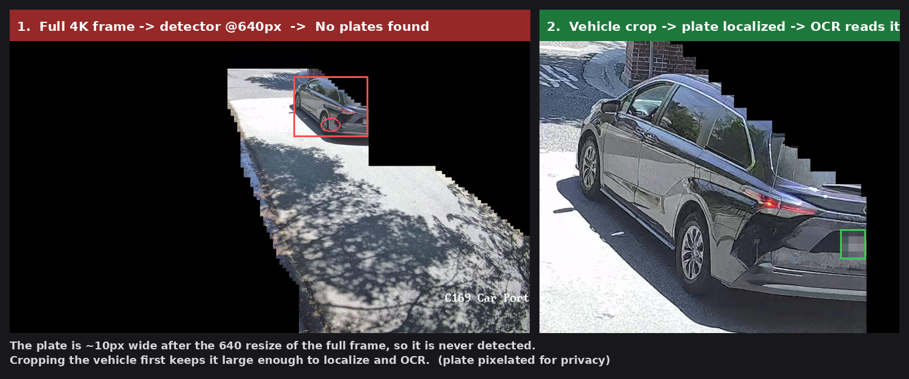

> **This is a fork of [codeproject/CodeProject.AI-ALPR](https://github.com/codeproject/CodeProject.AI-ALPR)** (the PaddleOCR "License Plate Reader") — for the original, go there. This fork adds **PaddleOCR GPU on Linux/CUDA 12** ([upstream PR #25](https://github.com/codeproject/CodeProject.AI-ALPR/pull/25)) and a **vehicle-crop fallback** ([upstream PR #26](https://github.com/codeproject/CodeProject.AI-ALPR/pull/26)).
> Comparing the CodeProject.AI ALPR options? See the guide in **[ALPRFast](https://github.com/chsbusch-dot/CodeProject.AI-ALPRFast#which-codeprojectai-alpr-module-should-i-use)**.

---

# ALPR Module for CodeProject.AI Server — enhanced fork

This is a fork of the official [CodeProject.AI ALPR module](https://github.com/codeproject/CodeProject.AI-ALPR)
(Automatic License Plate Recognition, PaddleOCR-based) for
[CodeProject.AI Server](https://github.com/codeproject/CodeProject.AI-Server).

It adds two independent fixes to the stock module:

1. **[Vehicle-crop fallback](#1-vehicle-crop-fallback-for-wide--high-resolution-scenes)** — reliable plate reads from **wide / high-resolution (4K) scenes**, where the stock module misses.
2. **[Working PaddleOCR GPU on Linux / CUDA 12](#2-paddleocr-gpu-on-linux--cuda-12)** — the stock module runs OCR on CPU on Linux; this makes it use the GPU.

Everything else (models, API, PaddleOCR pipeline, upstream dev/build workflow) is unchanged.

## How this relates to MikeLud's YOLO11 ALPR module

MikeLud's newer [License Plate Recognition (YOLO11) module](https://github.com/MikeLud/MikeLud-CodeProject.AI-Modules)
already has vehicle detection + cropping built in (`ENABLE_VEHICLE_DETECTION`) and is the
recommended forward path for new setups. This fork **does not try to replace it** — it
targets people staying on the stock **PaddleOCR** module, where two gaps remain:

- **Fix #1 (vehicle-crop fallback)** is the same *technique* MikeLud already uses,
  **backported** to the PaddleOCR module — mainly useful if you're not migrating.
- **Fix #2 (GPU on Linux) is the real gap:** *no* CodeProject.AI ALPR module — the stock
  PaddleOCR one **or** the YOLO11 one — currently runs on GPU on **Linux** (the YOLO11
  module uses `onnxruntime-directml`, i.e. Windows/DirectML + Apple/MPS only). So on a
  **Linux + NVIDIA** box this fork is currently the only way to get plate cropping **and**
  GPU acceleration together.

On Windows, or if you don't need Linux GPU, prefer MikeLud's YOLO11 module.

## Compatibility

Tested against:

| Component | Version |
|---|---|
| CodeProject.AI Server | 2.9.7 |
| ALPR module (base) | 3.3.4 |
| OS / arch | Ubuntu Linux, x86_64 |
| Python | 3.8 |
| PaddleOCR | 2.7.0.3 |
| PaddlePaddle (GPU) | 2.6.2.post120 (CUDA 12) |
| GPU | NVIDIA, driver CUDA 12.0–12.7, cuDNN 8.9 |

The two fixes are independent: the **vehicle-crop fallback** is platform-agnostic (any
OS / GPU / CPU), and the **GPU fix** applies to Linux x86_64 + NVIDIA CUDA 12. Install
the **`enhanced`** branch for both, or cherry-pick a single branch
(`alpr-vehicle-crop-fallback` or `cuda12-paddle-gpu`).

---

## 1. Vehicle-crop fallback for wide / high-resolution scenes



### The problem
The stock module sends the **whole frame** to a YOLO plate-detector that runs at
**`size=640`**. On a wide or 4K camera, a license plate is only a small part of the
scene, so after the image is resized to 640px wide the plate can shrink to a handful
of pixels and the detector simply never finds it — even though the plate is perfectly
legible to a human. The result is a stream of *"No plates found"* on cameras that
clearly show plates.

Concretely, on a 3840×2160 frame a plate ~60px wide becomes ~10px after the 640
resize — far too small to detect. Crop the same plate out of the full-res frame first
and it reads immediately.

### The fix
`ALPR.py` now does a **two-pass** detection:

1. Run plate detection on the full frame, as before.
2. **If that finds nothing**, call general object detection (`vision/detection`) for
   vehicles, crop each detected **car / truck / bus / motorcycle** (with padding, plus
   an extra lower/front-of-vehicle crop), and run the plate detector on those crops.
3. Any plate found in a crop has its box **translated back to full-frame coordinates**,
   then goes through the normal PaddleOCR read. Results are de-duplicated by IoU.

Because the crop is a small region of the original image, the plate keeps its pixels
through the 640 resize, so it detects and OCRs normally. Well-presented full-frame
plates still take the fast original path — the fallback only runs on a miss.

### Tuning (constants near the top of `ALPR.py`)
| Constant | Default | Purpose |
|---|---|---|
| `vehicle_labels` | car, truck, bus, motorcycle | which object classes to crop |
| `vehicle_confidence` | `0.25` | min confidence to treat a detection as a vehicle |
| `max_vehicle_crops` | `3` | cap on vehicles cropped per frame (bounds worst-case latency) |

### Cost
Each *miss* now adds one object-detection pass plus up to `max_vehicle_crops` × 2 plate
passes, so a fallback read is noticeably slower than a direct hit (order of ~1s vs
~150ms on our hardware). If throughput matters on a busy scene, lower `max_vehicle_crops`
or drop the second (lower-region) crop.

### Which object detector? (YOLOv5 vs YOLOv8 vs YOLO11)
The fallback uses whatever CodeProject.AI object-detection module is installed
(default: `ObjectDetectionYOLOv5-6.2`) via `vision/detection`, purely to find vehicles.
The detector *version* is **not the bottleneck**: locating a *car* in a scene is easy for
any YOLO generation (v5 / v8 / v11). The hard part is locating the small *plate*, which
the crop step solves. So upgrading the vehicle detector changes little for ALPR read
rates — any module that answers "where are the cars?" works. Upgrade it for general
detection speed/accuracy if you like, but not expecting more plate reads from it.

> **Requires an ObjectDetection module.** The fallback calls `vision/detection`, so a
> general object-detection module (e.g. the default `ObjectDetectionYOLOv5-6.2`) must be
> installed and running in CodeProject.AI. If it's disabled or unavailable, the fallback
> finds no vehicles and the module behaves like the stock full-frame-only ALPR.

---

## 2. PaddleOCR GPU on Linux / CUDA 12

The stock module notes *"GPU support on Linux is not currently supported."* In practice
that's three separate, fixable problems. This fork fixes all three so ALPR reports
`inferenceDevice=GPU` on a Linux/CUDA-12 host (tested on an RTX A5000, CUDA 12.4/12.7
driver, cuDNN 8.9, Python 3.8).

| File | Change | Why |
|---|---|---|
| `requirements.linux.cuda12.txt` | `paddlepaddle-gpu` → **`paddlepaddle-gpu==2.6.2.post120`** + `--extra-index-url https://www.paddlepaddle.org.cn/packages/stable/cu120/` | PyPI only ships CUDA≤11.7 builds of `paddlepaddle-gpu`, so the bare requirement silently installs a non-CUDA-12 build and ALPR falls back to CPU. The CUDA-12 (`.post120`) wheel only lives on Paddle's own index. Works on CUDA 12.0–12.7 drivers via minor-version forward compatibility. |
| `modulesettings.linux.json` | `"InstallGPU": false` → **`true`** | The adapter computes `use_gpu = enable_GPU and can_use_GPU`; the hardcoded `false` forced `enable_GPU` off even when a capable GPU was present. |
| `install.sh` | symlink **`libcudnn.so` → `libcudnn.so.8`** on Linux x86_64 | PaddlePaddle `dlopen`s the *unversioned* `libcudnn.so`, but Ubuntu's cuDNN package ships only `libcudnn.so.8`, causing `PreconditionNotMetError: Cannot load cudnn shared library`. |

> ⚠️ **Do not** upgrade to PaddlePaddle 3.x to get a newer CUDA build — it drops
> Python 3.8 and breaks PaddleOCR 2.7.0.3. Stay on `2.6.2.post120` + `paddleocr==2.7.0.3`.

### GPU-less or mixed hosts
`InstallGPU: true` is safe on Linux machines **without** a capable GPU. The adapter uses
`use_gpu = enable_GPU and can_use_GPU`, and `can_use_GPU` is false unless a suitable
NVIDIA GPU is present (it also checks compute capability ≥ 6 and cuDNN), so ALPR falls
back to CPU automatically — no need to flip `InstallGPU` back to `false`. These changes
are scoped to Linux x86_64 + CUDA 12; Windows, macOS, and CUDA 11 installs are untouched.

### Network caveat (China-hosted wheel)
The `.post120` wheel is hosted on `paddlepaddle.org.cn` / `bcebos.com`, which some
networks (and many datacenter/VM environments) cannot reach. If the install can't
download the wheel, fetch it from a machine that can and install the local file into
the module's venv:

```bash
# 2.6.2 CUDA-12 wheel (cp38 shown; pick the tag matching your venv's Python)
paddlepaddle_gpu-2.6.2.post120-cp38-cp38-linux_x86_64.whl
# then, inside the module venv:
python -m pip install /path/to/paddlepaddle_gpu-2.6.2.post120-*.whl
```

The `InstallGPU` flip and the `libcudnn.so` symlink do **not** need network access and
apply regardless.

### Verify
```bash
python -c "import paddle; paddle.utils.run_check()"   # -> "PaddlePaddle works well on 1 GPU"
```
and the CodeProject.AI ALPR module status should show `inferenceDevice: GPU`.

---

## Applying these changes to a running CodeProject.AI install

The changes live in the module's own files, so the simplest deployment is to replace
the installed module's `ALPR.py`, `requirements.linux.cuda12.txt`,
`modulesettings.linux.json` and `install.sh` with the versions from this branch (or
install the module from this repo), then restart the ALPR module.

Notes:
- Restarting/reinstalling the ALPR module resets its GPU/paddle state — re-run the
  GPU steps above (or your install) after any CodeProject.AI upgrade or container
  recreate.
- **Blue Iris users:** Blue Iris stops issuing ALPR requests after the ALPR module
  restarts and only re-arms them after a **Blue Iris restart** — so after deploying,
  reboot Blue Iris, otherwise the module looks idle even though it's healthy.

## Credits & license

Fork of [codeproject/CodeProject.AI-ALPR](https://github.com/codeproject/CodeProject.AI-ALPR);
all original code and models are theirs. Same license as upstream — see [LICENSE](LICENSE).
The vehicle-crop fallback and CUDA-12 GPU fixes in this fork are offered back upstream
via pull request.

---

# Upstream module documentation

The actual module is normally downloadable via the CodeProject.AI Server dashboard.

## To develop and debug this code

1. Clone the main [server repo](https://github.com/codeproject/CodeProject.AI-Server) into a directory such as `CodeProject/CodeProject.AI-Server`

2. Clone this ALPR repo into a separate folder `CodeProject/CodeProject.AI-Modules`

    You should now have

    ```text
    CodeProject
      - CodeProject.AI-Server
         - src
           - demos
           - server
           - ... etc
         - tests
      - CodeProject.AI-Modules
         - CodeProject.AI-ALPR (this repo)
         ...
    ```

3. **If you have NOT run dev setup on the server**
    Run the server dev setup scripts by opening a terminal in `CodeProject.AI-Server/src/` then, for Windows, run `setup.bat`, or for Linux/macOS run `bash setup.sh`.<br>
    This will setup the server, and will also setup this module as long as this module sits under a folder named `CodeProject.AI-Modules`, with `CodeProject.AI-Modules` being at the same folder level as `CodeProject.AI-Server`.

    **If you have already setup the server**
    You can run the setup for just this module running the setup script from a terminal opened in this folder
   ```BAT
   REM For Windows
   ..\..\CodeProject.AI-Server\src\setup.bat
   ```
   ```bash
   # For Linux/macOS
   bash ../../CodeProject.AI-Server/src/setup.sh
   ```
4. Open the server repo in Visual Studio Code (or Visual Studio) and build and launch the server (Build and Launch server in the Run and Debug menu in VS Code). This will start the server, which in turn will load the settings file from this module.
    <br>You can start this module directly from the CodeProject.AI Server dashboard, or you can run this module as a separate process via the 'Launch ALPR' Debug and Run option in VS Code.

## To create a package for this module

Assuming the folder structure outlined above, run

   ```BAT
   REM For Windows
   ..\..\CodeProject.AI-Server\devops\build\create_packages.bat
   ```
   ```bash
   # For Linux/macOS
   bash ../../CodeProject.AI-Server/devops/build/create_packages.sh
   ```
